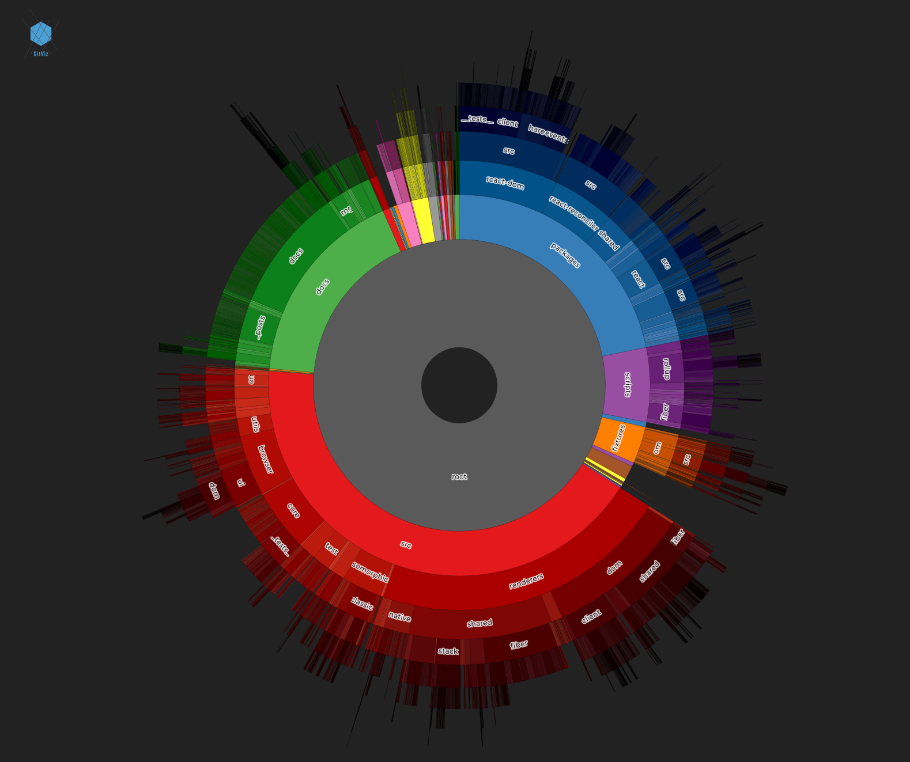

## Visualise changes in a Git repository

This utility contains tools to create interactive visualisations that help interrogate a Git repository. Specifically it offers tools that help a user find out the following:

1. Most committed files.
2. Least committed files.
3. The most stable files. (Not implemented yet)
4. The most stable directories. (Not implemented yet)

The data can be useful when considering areas of a repository (a mono-repo specifically) that can be moved or published separately and consumed as a package.

## References

-   https://stackoverflow.com/questions/1828874/generating-statistics-from-git-repository
-   https://blog.riff.org/2015_10_30_git_tip_of_the_day_show_the_hottest_files_in_a_repo

### An example visualisation

### Example

The following command will analyse the changes to `github.com/facebook/react` and write them to a file in the `packages/web`directory.

`packages/cli/src/cli.js -p ./packages/web/git-changes-react.json -r ../react`
